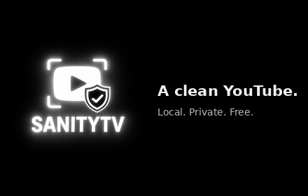
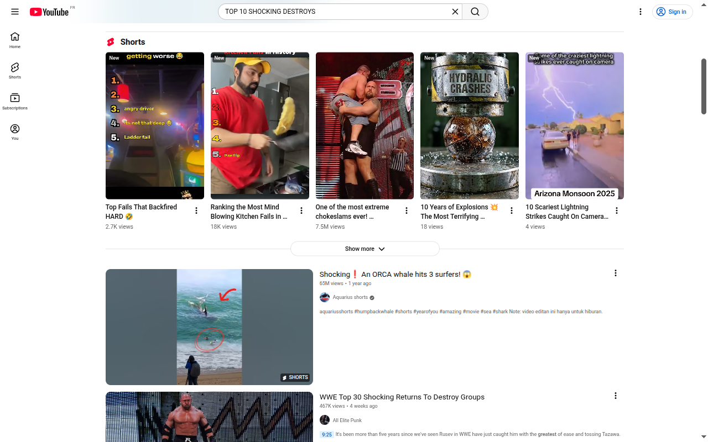
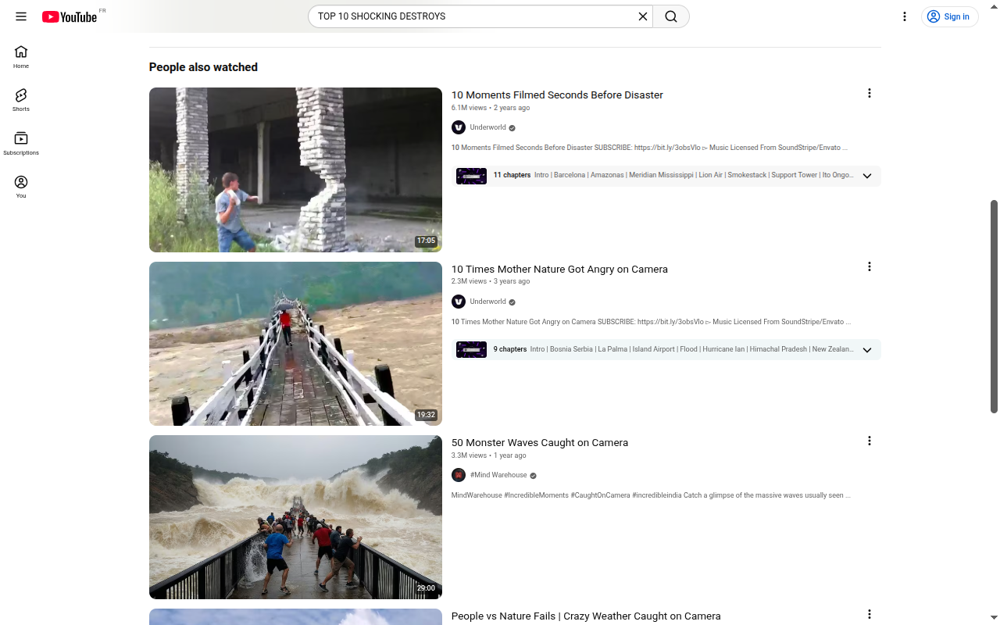
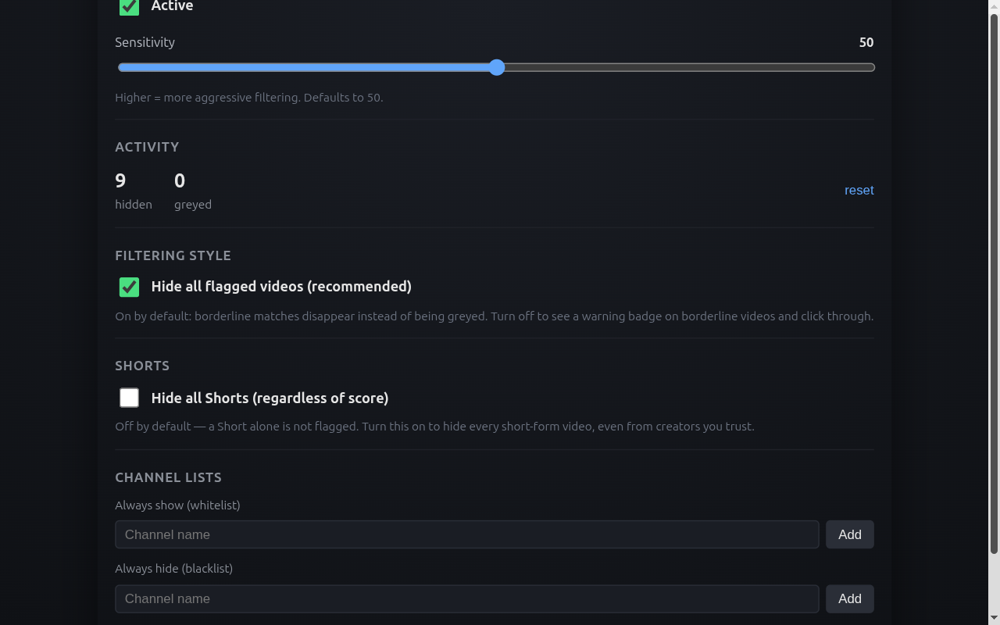

# SanityTV

> A clean YouTube. Local. Private. Free.

<!-- Logo: Tim is generating this, replace the next line when ready -->
<p align="center">
  
</p>

SanityTV is a Chrome extension that automatically removes YouTube
videos engineered to hijack your attention — clickbait, rage-bait,
sensationalism, brainrot Shorts, and content harmful to children.
Your feed stays full of what's actually worth watching.

Everything happens inside your browser. Nothing leaves your device.
No account, no API key, no tracking, no monetisation.

---

## See the difference

Same search query, same browser. Left: SanityTV paused. Right:
SanityTV active with the default settings.

**Before** — Shorts shelf, screaming thumbnails, listicles, "shocking"
everywhere:

<p align="center">
  
</p>

**After** — the noise is gone. The Shorts shelf is silent, the most
aggressive cards are out of the feed, and what remains is browsable
without flinching:

<p align="center">
  
</p>

---

## What gets filtered

| Category                | Examples we hide                                                                                                                                             |
| ----------------------- | ------------------------------------------------------------------------------------------------------------------------------------------------------------ |
| **Clickbait titles**    | _TOP 10 SHOCKING …_, _You won't believe …_, _Vous n'allez pas croire …_, all-caps shouting, emoji spam, ponctuation excessive                                |
| **Rage-bait**           | _Ben Shapiro DESTROYS …_, _Le ministre HUMILIÉ_, culture-war framings, vs/contre confrontations                                                              |
| **Sensationalism**      | _The truth they don't want you to know_, _illuminati_, _nouvel ordre mondial_, hyperbolic superlatives, morbid tabloid keywords (viol, meurtre, massacre, …) |
| **Brainrot Shorts**     | A Short alone is a soft signal — combined with any other clickbait pattern it disappears                                                                     |
| **Harmful kid content** | _Frozen Elsa pregnant by Spider-Man_-style Elsagate, named dangerous challenges (Tide Pod, Blackout, Skull Breaker, …)                                       |

It works in **English and French** out of the box.

---

## What stays

| Kept (untouched)                                                                        |
| --------------------------------------------------------------------------------------- |
| Serious educators (Veritasium, Kurzgesagt, Fouloscopie, …)                              |
| Real journalism (Le Monde, ARTE, PBS, BBC)                                              |
| Tutorials, tech reviews, music, vlogs, lifestyle                                        |
| Academic lectures, even when they cover hard topics (war, atrocities) — context matters |
| Sport play-by-play and gaming, where combat language is literal                         |

---

## The popup

Click the SanityTV icon in your toolbar to open the controls:

<p align="center">
  
</p>

- **Active / Paused** — one click to disable filtering on demand.
- **Sensitivity** — slider from gentle to aggressive. The default 50
  is the recommended balance.
- **Activity** — counters of how many videos were hidden (resettable).
- **Filtering style** — _on by default_: flagged videos disappear
  outright. Turn it off to get a softer experience: borderline
  videos are dimmed with a `⚠` badge and stay clickable.
- **Hide all Shorts** — _off by default_. Turn on to skip every
  short-form video, even from creators you trust.
- **Channel lists** — always show some channels (whitelist) or always
  hide others (blacklist), regardless of the score.

---

## Privacy

SanityTV does not collect, transmit, or sell any data. The full
[privacy policy](./docs/PRIVACY.md) explains exactly what the
extension reads (visible video titles, channel names and durations on
YouTube pages, never written to disk and never sent anywhere).

The extension only requests two permissions:

- `storage` — to keep your settings on your device.
- `*://*.youtube.com/*` — to inject the filter into YouTube pages
  (and only YouTube pages).

No other website is touched. No analytics, no third-party SDK, no
network call.

---

## Install

**From the Chrome Web Store** — coming soon. The submission package is
ready and the listing is in [`store-assets/`](./store-assets/).

**Manual install (developer mode)** while the store review is pending:

1. Clone the repo and run `npm install`
2. `npm run build`
3. Open `chrome://extensions`, enable **Developer mode** (top right)
4. Click **Load unpacked** and select the `dist/` folder

---

## Roadmap

- [x] **Phase 1** — Detection engine + popup UI
- [x] **Phase 2** — Quality bar (synthetic + empirical regression
      suites, 7 ADRs)
- [x] **Phase 3** — Chrome Web Store submission package ready
- [ ] **Phase 4** — Publish on the Chrome Web Store
- [ ] **Phase 5** — Firefox port

---

## For developers

Curious how it works, want to contribute, or want to verify there is
no funny business in the source? Welcome.

### Tech stack

- TypeScript 5 strict
- Vite + [`@crxjs/vite-plugin`](https://crxjs.dev/) for Manifest V3
- React 18 (popup)
- Vitest + Testing Library (unit)
- Playwright (empirical regression harness)
- ESLint 9 (flat config) + Prettier
- Husky + lint-staged
- GitHub Actions (CI: lint, format, typecheck, test, build)

Requires Node ≥ 20 and npm.

```bash
npm install
npm run dev          # vite dev with HMR
npm run build        # production build → dist/
npm run typecheck
npm run lint
npm test
```

### Project layout

```
src/
├── background/   # MV3 service worker
├── content/      # Content scripts injected on YouTube pages
│   ├── observer.ts
│   ├── extractor.ts
│   └── injector.ts
├── detection/
│   ├── rules/    # 5 detector files
│   └── scorer.ts # Signal aggregation (sum, capped at 100)
├── popup/        # React popup app
├── storage/      # chrome.storage abstraction (settings + stats)
└── types/

tests/                # 124 unit tests across 10 files
scripts/              # diagnose, regression-test, icon/promo generators
docs/
├── PRIVACY.md
└── adr/              # 7 architecture decision records
store-assets/         # listing copy, screenshots, promo tile, submission README
```

### Quality bar

Two harnesses must be green before any rule change ships:

- **Synthetic** — `tests/regression-corpus.test.ts`, ~60 curated titles
  with an `expected` display band. Runs in CI. **60/60 currently pass.**
- **Empirical** — `node scripts/regression-test.mjs` walks ~18 real
  YouTube searches and asserts macro thresholds per query.
  **16/18 currently pass.** The two accepted limitations are
  documented in [ADR-0006](./docs/adr/0006-regression-test-strategy.md).

### Architecture decisions

Major design decisions are documented as ADRs under
[`docs/adr/`](./docs/adr/):

- [ADR-0001](./docs/adr/0001-no-byok-no-embedded-keys.md) — No BYOK, no embedded API keys
- [ADR-0002](./docs/adr/0002-sum-aggregation-not-mean.md) — Aggregate signals by sum, not weighted mean
- [ADR-0003](./docs/adr/0003-three-level-display-not-binary.md) — Three-level display strategy (with hide-all default)
- [ADR-0004](./docs/adr/0004-dom-dedup-via-data-attribute.md) — DOM dedup via attribute marker
- [ADR-0005](./docs/adr/0005-shorts-format-not-inherently-brainrot.md) — Shorts format ≠ brainrot
- [ADR-0006](./docs/adr/0006-regression-test-strategy.md) — Regression test strategy (synthetic + empirical)
- [ADR-0007](./docs/adr/0007-not-a-parental-control.md) — Not a parental control

### Not a parental control

SanityTV's `harmful_kid_content` rule does mask Elsagate-style content
and named dangerous challenges, but **this is not a substitute for a
parental control**. A determined adversary defeats heuristic filters
trivially. For real protection of a child's YouTube experience, use
[YouTube Kids](https://www.youtubekids.com/) or a dedicated parental
control product. See [ADR-0007](./docs/adr/0007-not-a-parental-control.md).

### Contributing

See [CONTRIBUTING.md](./CONTRIBUTING.md). The repo enforces
Conventional Commits, lint, typecheck, and test on every commit.

---

## License

[MIT](./LICENSE) — use it, fork it, audit it.
